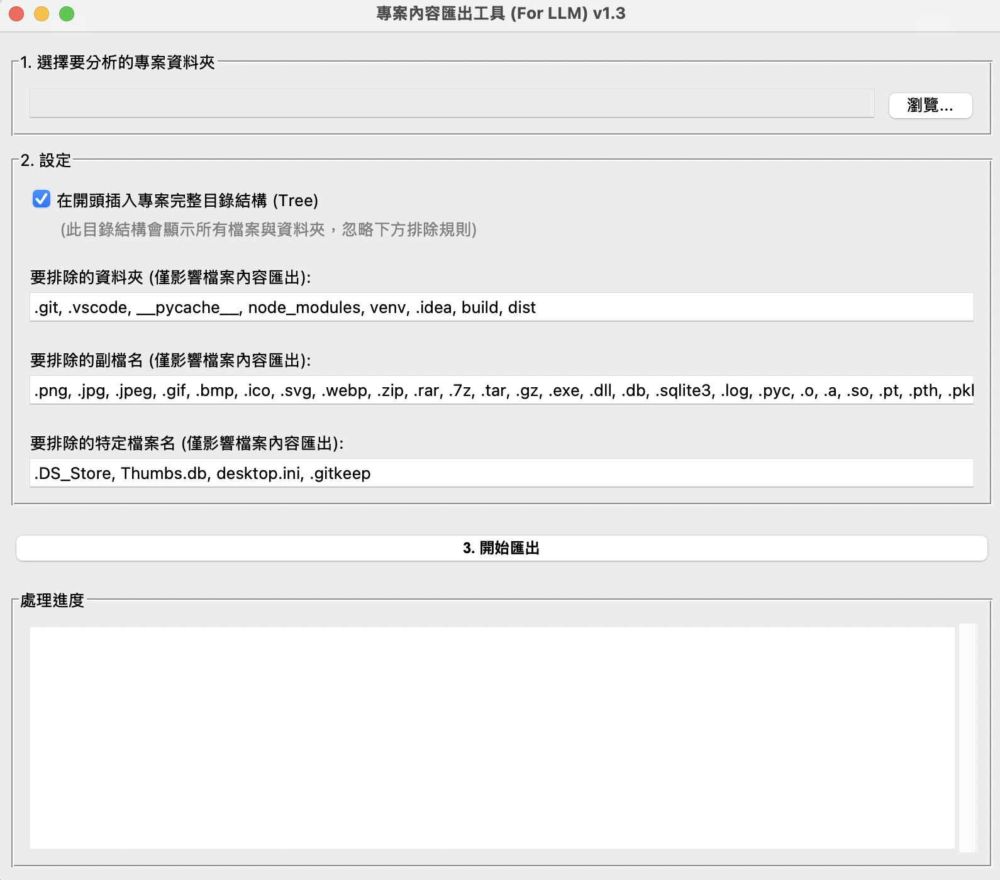

# 🚀 AI 專案內容匯出工具 v2.0

[](https://www.python.org/)
[]()
[]()

一個現代化的桌面應用程式，專為將專案內容匯出為 **LLM 友善格式** 而設計。透過美觀的圖形介面和智能的檔案選擇功能，讓您輕鬆將專案程式碼整理成適合 AI 大型語言模型（如 Claude、GPT-4、Gemini 等）處理的格式。



## ✨ 主要特色

### 🎨 **現代化使用者介面**
- **雙面板設計**：左側專案設定，右側即時進度
- **專業配色方案**：淺色主題，清晰易讀
- **響應式佈局**：自適應視窗大小
- **圖標化設計**：豐富的 emoji 圖標提升視覺體驗

### 🌲 **互動式檔案樹**
- **智能檔案瀏覽器**：視覺化展示專案結構
- **一鍵選擇控制**：點擊即可勾選/取消檔案
- **批次操作**：選擇資料夾自動應用到所有子項目
- **檔案類型圖標**：Python🐍、JavaScript🟨、HTML🌐 等直觀顯示

### 📋 **智能輸出格式**
- **完整目錄結構**：專案架構一目了然
- **精確內容匯出**：只包含您選擇的檔案
- **LLM 優化格式**：適合 AI 模型理解的結構化輸出
- **自動隱藏檔案過濾**：排除 `.git`、`.DS_Store` 等系統檔案

### 🚀 **優化的使用體驗**
- **即時進度回饋**：詳細的處理狀態顯示
- **線程安全處理**：不會凍結界面
- **友善的歡迎介面**：內建使用說明
- **錯誤處理機制**：優雅處理各種異常情況

## 🛠️ 系統需求

- **Python**: 3.7 或更高版本
- **作業系統**: Windows、macOS、Linux
- **依賴套件**: 僅使用 Python 標準庫（tkinter、threading、os）

## 📥 安裝與執行

### 快速開始

1. **下載專案**
   ```bash
   git clone https://github.com/yourusername/context_parser.git
   cd context_parser
   ```

2. **執行應用程式**
   ```bash
   python main.py
   ```

3. **開始使用！** 🎉

## 📖 使用指南

### 🎯 基本操作流程

1. **📁 選擇專案資料夾**
   - 點擊「瀏覽」按鈕
   - 選擇您要分析的專案根目錄

2. **🌲 選擇要匯出的檔案**
   - 檢視自動生成的專案檔案樹
   - 點擊檔案/資料夾來勾選或取消
   - ✅ = 已選擇，❌ = 未選擇

3. **⚙️ 配置輸出選項**
   - 勾選「在開頭插入完整專案目錄結構」（推薦）

4. **🚀 執行匯出**
   - 點擊「開始匯出」按鈕
   - 選擇儲存位置和檔名
   - 等待處理完成

### 💡 使用技巧

- **批次選擇**：點擊資料夾可一次選擇/取消其下所有檔案
- **快速定位**：使用檔案類型圖標快速識別不同檔案
- **進度監控**：右側面板實時顯示處理狀態
- **錯誤追蹤**：詳細的錯誤訊息幫助診斷問題

## 📄 輸出格式範例

```
專案完整目錄結構 (已排除隱藏檔案):
```
my_project/
├── src/
│   ├── main.py
│   ├── utils.py
│   └── config.json
├── tests/
│   └── test_main.py
├── README.md
└── requirements.txt
```

(src/main.py的內容)
```python
def main():
    print("Hello, World!")

if __name__ == "__main__":
    main()
```

(README.md的內容)
```markdown
# My Project
This is a sample project.
```
```

## 🔧 技術架構

### 核心元件

- **UI 層**: 現代化 tkinter GUI，雙面板響應式設計
- **檔案處理**: 多線程安全的檔案讀取和處理
- **樹狀結構**: 遞歸目錄遍歷和視覺化展示
- **輸出生成**: 結構化文本格式，針對 LLM 優化

### 主要類別

- `App`: 主應用程式類，處理 UI 和用戶互動
- `ModernButton`: 自定義按鈕元件，支持懸停效果
- `generate_full_tree()`: 智能目錄樹生成函數
- `create_project_summary()`: 核心匯出處理函數

## 🎨 支持的檔案類型圖標

| 副檔名 | 圖標 | 語言/類型 |
|--------|------|-----------|
| .py | 🐍 | Python |
| .js | 🟨 | JavaScript |
| .ts | 🔷 | TypeScript |
| .html | 🌐 | HTML |
| .css | 🎨 | CSS |
| .json | 📋 | JSON |
| .md | 📝 | Markdown |
| .yml/.yaml | ⚙️ | YAML |
| .java | ☕ | Java |
| .cpp | ⚡ | C++ |
| .go | 🐹 | Go |
| .rs | 🦀 | Rust |
| ...其他 | 📄 | 一般檔案 |

## ❓ 常見問題

### Q: 為什麼有些檔案沒有顯示在樹狀圖中？
A: 所有以 `.` 開頭的隱藏檔案（如 `.git`, `.DS_Store`）會自動被排除，這是為了保持輸出的整潔。

### Q: 可以一次選擇整個資料夾嗎？
A: 是的！點擊資料夾會自動選擇或取消其下的所有檔案和子資料夾。

### Q: 輸出的檔案很大，正常嗎？
A: 這取決於您選擇的檔案數量和大小。建議只選擇核心程式碼檔案，避免包含大型資料檔案。

### Q: 支援哪些作業系統？
A: 支援所有安裝了 Python 的系統：Windows、macOS、Linux。

## 🤝 貢獻

歡迎提交 Issue 和 Pull Request！如果您有任何建議或發現了 bug，請不吝指教。

 